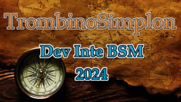

# 2024 dev inte bsm

Développeur Intégrateur  
Boulogne sur Mer, Hauts-de-France

<!-- ## Qui sommes nous

<figure>
    

        
    

    

        <figcaption>
            <a href="https://2024-dev-inte-bsm.github.io/trombi" align="center">Trombinoscope</a>
        </figcaption>
    

</figure> -->

## Les technologies utilisées

&nbsp;&nbsp;

&nbsp;&nbsp;

&nbsp;&nbsp;

&nbsp;&nbsp;

&nbsp;&nbsp;

&nbsp;&nbsp;

## Nos réalisations

| Briefs | Technologies | <a href="https://github.com/2024-dev-inte-bsm/nickname">❔</a> | <a href="https://github.com/2024-dev-inte-bsm/nickname">❔</a> | <a href="https://github.com/2024-dev-inte-bsm/nickname">❔</a> | <a href="https://github.com/2024-dev-inte-bsm/nickname">❔</a> | <a href="https://github.com/2024-dev-inte-bsm/nickname">❔</a> | <a href="https://github.com/2024-dev-inte-bsm/nickname">❔</a> | <a href="https://github.com/2024-dev-inte-bsm/nickname">❔</a> | <a href="https://github.com/2024-dev-inte-bsm/nickname">❔</a> | <a href="https://github.com/2024-dev-inte-bsm/nickname">❔</a> | <a href="https://github.com/2024-dev-inte-bsm/nickname">❔</a> | <a href="https://github.com/2024-dev-inte-bsm/nickname">❔</a> | <a href="https://github.com/2024-dev-inte-bsm/nickname">❔</a> |
| :----: | :----: | :----: | :----: | :----: | :----: | :----: | :----: | :----: | :----: | :----: | :----: | :----: | :----: |
| [About_Me](https://github.com/2024-dev-inte-bsm/about_me) | &nbsp;&nbsp; | <a href="https://github.com/2024-dev-inte-bsm/brief-abc">🔗</a> | <a href="https://github.com/2024-dev-inte-bsm/brief-abc">🔗</a> | <a href="https://github.com/2024-dev-inte-bsm/brief-abc">🔗</a> | <a href="https://github.com/2024-dev-inte-bsm/brief-abc">🔗</a> | <a href="https://github.com/2024-dev-inte-bsm/brief-abc">🔗</a> | <a href="https://github.com/2024-dev-inte-bsm/brief-abc">🔗</a> | <a href="https://github.com/2024-dev-inte-bsm/brief-abc">🔗</a> | <a href="https://github.com/2024-dev-inte-bsm/brief-abc">🔗</a> | <a href="https://github.com/2024-dev-inte-bsm/brief-abc">🔗</a> | <a href="https://github.com/2024-dev-inte-bsm/brief-abc">🔗</a> | <a href="https://github.com/2024-dev-inte-bsm/brief-abc">🔗</a> | <a href="https://github.com/2024-dev-inte-bsm/brief-abc">🔗</a> |

## Auteurs, contributeurs

* [Nicolas Herbez](https://github.com/nicolas-herbez)
* [Rémy Cottrez](https://github.com/RemyCTRZ)
